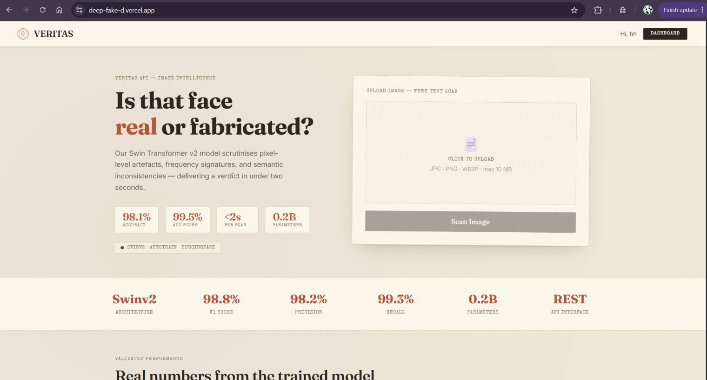
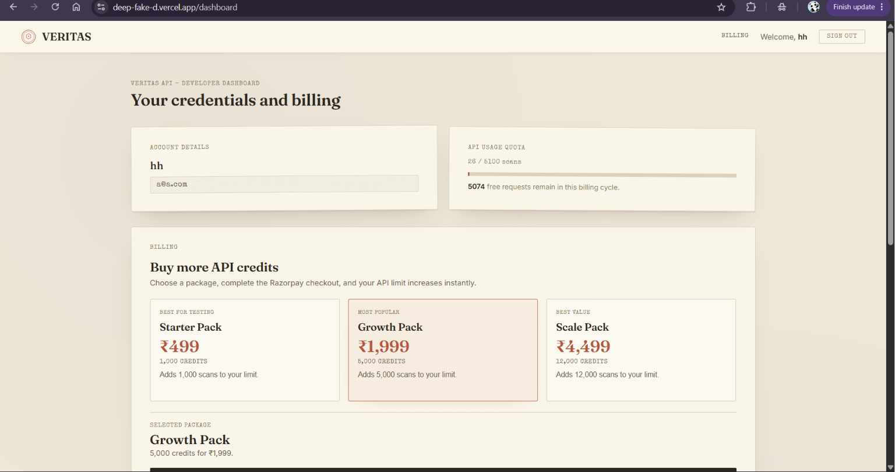
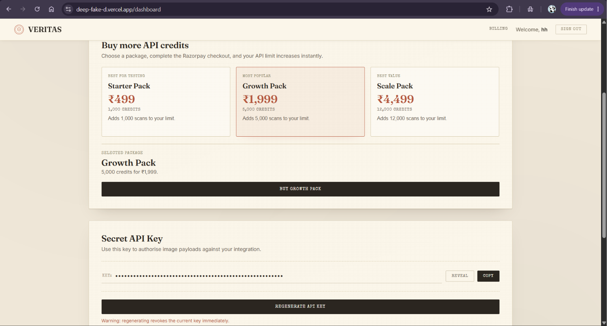
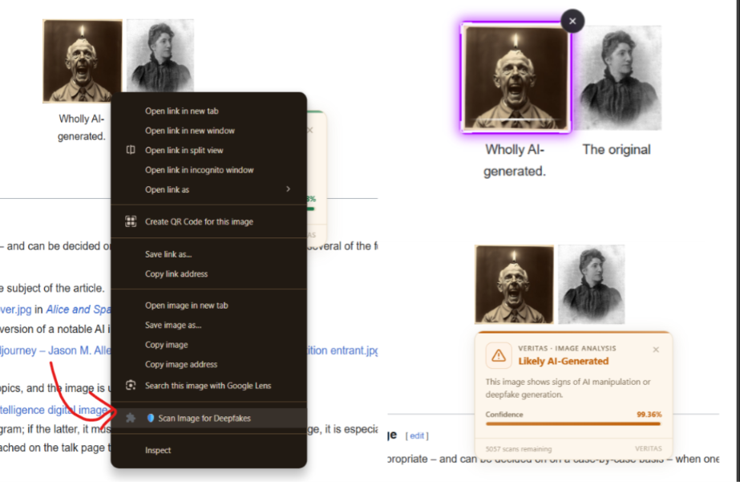

# 🛡️ Veritas — AI Deepfake Detection Platform

<div align="center">

### Detect AI-Generated & Manipulated Images with Confidence

**Veritas** is a full-stack AI-powered deepfake detection platform that allows developers, businesses, and end users to verify image authenticity using a modern web application, REST API, and browser extension.

Built with **React**, **Node.js**, **MongoDB**, **FastAPI**, **Hugging Face Transformers**, and a **Chrome Extension** for real-time image verification directly from the web.

---


</div>

---

## 🔗 Links

- 🌐 Live App: https://deep-fake-d.vercel.app/
- 📦 API: https://deepfake-d90n.onrender.com
- 🤖 AI Service: https://utkarsh-singh-deepfake.hf.space/api/v1/predict/image
- 📚 Documentation: https://github.com/Utkarsh-Singh-u/Veritas
- Chrome Extention: Coming Soon

---

## 📸 Screenshots

### Landing Page



### Dashboard



### Billing Page



### Chrome Extension




---

# 📑 Table of Contents

* [Overview](#-overview)
* [Key Features](#-key-features)
* [System Architecture](#-system-architecture)
* [Project Structure](#-project-structure)
* [Technology Stack](#-technology-stack)
* [Application Flow](#-application-flow)
* [Backend Architecture](#-backend-architecture)
* [AI Service Architecture](#-ai-service-architecture)
* [Chrome Extension](#-chrome-extension)
* [Authentication Flow](#-authentication-flow)
* [Billing System](#-billing-system)
* [Installation Guide](#-installation-guide)
* [Environment Variables](#-environment-variables)
* [API Documentation](#-api-documentation)
* [Usage Examples](#-usage-examples)
* [Deployment Guide](#-deployment-guide)
* [Security Features](#-security-features)
* [Future Improvements](#-future-improvements)
* [License](#-license)

---

# 🎯 Overview

The rise of AI-generated content has created significant challenges in verifying digital authenticity. Veritas addresses this problem by providing an accessible platform for detecting AI-generated and manipulated images.

Users can:

✅ Upload images through a web dashboard

✅ Detect AI-generated images using a trained Hugging Face model

✅ Generate API keys for external integrations

✅ Scan images directly from the browser using a Chrome Extension

✅ Purchase additional scan credits

✅ Monitor API usage and scan history

✅ Integrate image verification into their own products

---

# ✨ Key Features

## User Management

* User Registration
* Secure Login
* JWT Authentication
* Refresh Token System
* Cookie-Based Sessions

## Developer API

* API Key Generation
* API Key Rotation
* Usage Tracking
* Credit Management
* Rate Limiting

## Deepfake Detection

* AI-Powered Image Analysis
* Confidence Scoring
* Authentic vs AI-Generated Classification
* Fast Processing Pipeline

## Browser Extension

* Right-click image scanning
* Inline scan results
* Remaining credit display
* Real-time webpage integration
* No manual image downloads required

## Billing System

* Razorpay Integration
* Credit Purchase Packages
* Payment Verification
* Purchase History
* Automatic Credit Allocation

---

# 🏗️ System Architecture

```text
┌─────────────────────────────────────────┐
│                 Frontend                │
│                                         │
│ React + Vite                            │
│ Dashboard                               │
│ Authentication                          │
│ Billing UI                              │
│ API Key Management                      │
└─────────────────┬───────────────────────┘
                  │
                  ▼
┌─────────────────────────────────────────┐
│                 Backend                 │
│                                         │
│ Node.js + Express                       │
│ JWT Authentication                      │
│ API Key Validation                      │
│ Usage Tracking                          │
│ Razorpay Billing                        │
│ MongoDB Persistence                     │
└─────────────────┬───────────────────────┘
                  │
                  ▼
┌─────────────────────────────────────────┐
│              AI Service                 │
│                                         │
│ FastAPI                                 │
│ Transformers Pipeline                   │
│ Image Classification                    │
│ Deepfake Detection                      │
└─────────────────┬───────────────────────┘
                  │
                  ▼
┌─────────────────────────────────────────┐
│         Hugging Face Model              │
│                                         │
│ haywoodsloan/ai-image-detector-dev-deploy
└─────────────────────────────────────────┘


                  ▲
                  │
┌─────────────────────────────────────────┐
│           Chrome Extension              │
│                                         │
│ Context Menu Scanning                   │
│ Overlay UI                              │
│ API Key Authentication                  │
└─────────────────────────────────────────┘
```

---

# 📂 Project Structure

```text
project/
│
├── backend/
│   ├── src/
│   │   ├── controllers/
│   │   ├── routes/
│   │   ├── middlewares/
│   │   ├── models/
│   │   ├── db/
│   │   ├── utils/
│   │   ├── app.js
│   │   └── index.js
│   │
│   ├── package.json
│   └── .env
│
├── frontend/
│   ├── src/
│   │   ├── Pages/
│   │   ├── Context/
│   │   ├── App.jsx
│   │   └── main.jsx
│   │
│   ├── package.json
│   └── .env
│
├── ai-service/
│   ├── main.py
│   ├── requirements.txt
│   └── Dockerfile
│
├── extension/
│   ├── manifest.json
│   ├── background.js
│   ├── popup.js
│   └── popup.html
│
└── README.md
```

---

# ⚙️ Technology Stack

## Frontend

* React
* Vite
* Context API
* Axios
* Modern JavaScript

## Backend

* Node.js
* Express.js
* MongoDB
* Mongoose
* JWT
* Multer
* Axios
* Cookie Parser
* CORS

## AI Service

* Python
* FastAPI
* Transformers
* PyTorch
* Pillow
* Uvicorn

## Extension

* Chrome Extension API
* Manifest V3
* Context Menus API
* Storage API
* Scripting API

## Payments

* Razorpay

---

# 🔄 Application Flow

```text
User Uploads Image
        │
        ▼
Frontend
        │
        ▼
Backend Validation
        │
        ▼
AI Service
        │
        ▼
Hugging Face Model
        │
        ▼
Prediction Result
        │
        ▼
Frontend Dashboard
```

---

# 🔐 Authentication Flow

```text
Register
   │
   ▼
User Created
   │
   ▼
Access Token Generated
Refresh Token Generated
   │
   ▼
Stored in Cookies
   │
   ▼
Protected Routes
```

---

# 🧠 AI Service Architecture

The AI engine is implemented as a dedicated FastAPI microservice.

## Endpoint

```http
POST /api/v1/predict/image
```

### Request

```multipart/form-data
file=<image>
```

### Response

```json
{
  "status": "success",
  "verdict": "real",
  "confidence": 97.82
}
```

### Model Used

```text
haywoodsloan/ai-image-detector-dev-deploy
```

The model is loaded using the Hugging Face Transformers image classification pipeline.

---

# 🌐 Chrome Extension

The Veritas browser extension enables instant image verification anywhere on the internet.

## Workflow

1. Generate API Key from Dashboard
2. Open Extension Popup
3. Save API Key
4. Right-click any image
5. Select:

```text
🛡️ Scan Image for Deepfakes
```

6. Wait for analysis
7. View result overlay

## Features

### Animated Scanner Overlay

* RGB scanning animation
* Image highlighting
* Scan cancellation support

### Result Card

Displays:

* Authentic / AI Generated
* Confidence Score
* Remaining Credits

---

# 💳 Billing System

Veritas includes a credit-based usage model.

## Available Packages

| Package | Credits |
| ------- | ------- |
| Starter | 1000    |
| Growth  | 5000    |
| Scale   | 12000   |

## Billing Flow

```text
User Selects Package
         │
         ▼
Create Razorpay Order
         │
         ▼
Payment Gateway
         │
         ▼
Verify Signature
         │
         ▼
Credits Added
```

---

# 🚀 Installation Guide

## 1. Clone Repository

```bash
git clone https://github.com/Utkarsh-Singh-u/DeepFake.git
cd DeepFake
```

---

## 2. Backend Setup

```bash
cd backend

npm install
```

### Start Development Server

```bash
npm run dev
```

---

## 3. Frontend Setup

```bash
cd frontend

npm install

npm run dev
```

---

## 4. AI Service Setup

```bash
cd ai-service

pip install -r requirements.txt
```

Run:

```bash
uvicorn main:app --reload
```

---

# 🔧 Environment Variables

## Backend

```env
PORT=

MONGO_URI=

JWT_SECRET=

ACCESS_TOKEN_SECRET=
ACCESS_TOKEN_EXPIRY=5d

REFERESH_TOKEN_SECRET=
REFERESH_TOKEN_EXPIRY=15d

AI_SERVICE_URL=

NODE_ENV=development

RAZORPAY_KEY_ID=
RAZORPAY_KEY_SECRET=
```

---

## Frontend

```env
VITE_BASE_URL=
```

---

# 📡 API Documentation

## User APIs

### Register

```http
POST /api/v1/user/register
```

### Login

```http
POST /api/v1/user/login
```

### Current User

```http
GET /api/v1/user/me
```

### Generate API Key

```http
POST /api/v1/user/getapikey
```

### Logout

```http
GET /api/v1/user/logout
```

---

## Deepfake Detection API

### Scan Image

```http
POST /api/v1/ai-service/predict
```

Headers:

```http
x-api-key: YOUR_API_KEY
```

Body:

```multipart/form-data
image=<image-file>
```

---

## Billing APIs

### Create Order

```http
POST /api/v1/billing/order
```

### Verify Payment

```http
POST /api/v1/billing/verify
```

### Payment History

```http
GET /api/v1/billing/history
```

---

# 🧪 Usage Example

## JavaScript

```javascript
const formData = new FormData();
formData.append("image", imageFile);

const response = await fetch(
  "/api/v1/ai-service/predict",
  {
    method: "POST",
    headers: {
      "x-api-key": "YOUR_API_KEY"
    },
    body: formData
  }
);

const data = await response.json();
console.log(data);
```

---

# 🔒 Security Features

* JWT Authentication
* Refresh Token Rotation
* HttpOnly Cookies
* API Key Authentication
* Rate Limiting
* Credit Enforcement
* Secure Password Hashing (bcrypt)
* Payment Signature Verification
* CORS Protection

---

# ☁️ Deployment Guide

## Frontend

Deploy to:

* Vercel

## Backend

Deploy to:

* Render

## AI Service

Deploy to:

* Hugging Face

## Database

* MongoDB Atlas

---

# 🔮 Future Improvements

* Video Deepfake Detection
* Audio Deepfake Detection
* Batch Image Scanning
* Team Accounts
* Scan Analytics Dashboard
* Webhooks
* SDK Support
* Browser Extension for Firefox
* Enterprise Plans
* Model Ensemble Detection
* Scan History Storage
* OCR-based Authenticity Checks

---

# 🤝 Contributing

Contributions are welcome.

1. Fork the repository
2. Create a feature branch

```bash
git checkout -b feature/new-feature
```

3. Commit changes

```bash
git commit -m "Added new feature"
```

4. Push branch

```bash
git push origin feature/new-feature
```

5. Open a Pull Request

---

# 📜 License

This project is licensed under the ISC License.

---

<div align="center">

### 🛡️ Veritas

**Trust What You See. Verify What You Don't.**

Built with ❤️ using React, Node.js, FastAPI, MongoDB, Hugging Face, and Chrome Extensions.

</div>
